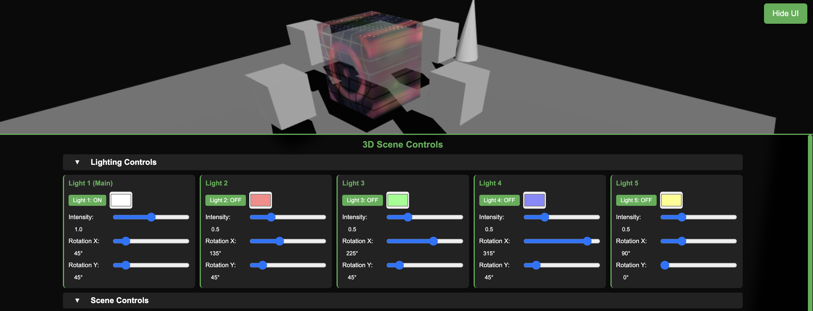

# 3D Emissive Scene



A comprehensive interactive 3D web application built with Three.js featuring advanced lighting, particle systems, custom shaders, and detailed object inspection tools.

## ✨ Features

### 🎮 **Advanced Lighting System**
- **5 Dynamic Lights**: Individual control over directional lights with color, intensity, and positioning
- **Real-time Shadows**: PCF soft shadow mapping with dynamic light sources
- **Light Visualization**: Toggle light helper visibility to see light positions and directions
- **Automatic Background**: Background color adapts to lighting intensity

### 🎨 **Custom Shader System**
- **15 Shader Examples**: Organized into Nature, Mathematical, and Sci-Fi categories
- **Live Shader Editor**: Paste and apply custom GLSL fragment shaders in real-time
- **Shader Library**: Pre-built examples including fractals, plasma, ocean waves, quantum fields, and more
- **Error Handling**: Real-time shader compilation with error reporting
- **Animated Uniforms**: Built-in time, resolution, and position uniforms for dynamic effects

### ⚡ **Particle System**
- **Configurable Particles**: 100-2000 animated particles with physics simulation
- **Realistic Physics**: Gravity, ground collision, and particle recycling
- **Visual Effects**: Emissive particles with additive blending for glow effects
- **Performance Optimized**: Efficient particle management and rendering

### 🔍 **Object Inspector**
- **Geometry Analysis**: Real-time vertex, face, and mesh count display
- **Material Information**: Detailed emissive material properties and colors
- **Visual Tools**: Bounding box visualization and object-specific wireframe
- **Material Controls**: Live emissive intensity and opacity adjustment
- **Property Display**: Technical information in monospace format

### 🎬 **Scene Controls**
- **Background Customization**: Color picker with lighting-responsive dimming
- **Render Modes**: Materials toggle, global wireframe, and light helper visibility
- **Transform Controls**: Model scaling and 3-axis rotation with live feedback
- **Auto-scaling**: Intelligent model sizing to fit environment bounds

### 📱 **User Interface**
- **Consolidated UI**: Single bottom panel with collapsible sections
- **Responsive Design**: Mobile-friendly with adaptive layouts
- **Minimal Footprint**: Compact design maximizes 3D viewport space
- **Organized Categories**: Logical grouping of controls for easy navigation

## 🚀 Getting Started

### Prerequisites
- Modern web browser with WebGL support
- Local HTTP server (required for model and shader loading)

### Installation
```bash
# Clone the repository
git clone <repository-url>
cd emmsive

# Start local server (choose one)
python -m http.server 8000
# or
npx serve .
# or use any HTTP server

# Open browser to http://localhost:8000
```

## 📁 Project Structure

```
emmsive/
├── index.html              # Main application
├── style.css               # UI styling
├── script.js               # Application logic
├── resources/               # Documentation assets
│   └── ss.png              # Screenshot for README
├── models/                  # 3D model assets
│   └── test.glb            # Default test model
├── examples/                # Shader library
│   ├── holographic_interference.txt
│   ├── plasma_energy.txt
│   ├── crystalline_lattice.txt
│   ├── ocean_waves.txt
│   ├── fire_flames.txt
│   ├── forest_growth.txt
│   ├── storm_lightning.txt
│   ├── fractal_mandelbrot.txt
│   ├── geometric_tessellation.txt
│   ├── wave_interference.txt
│   ├── mathematical_spirals.txt
│   ├── digital_matrix.txt
│   ├── space_nebula.txt
│   ├── quantum_fields.txt
│   └── cyber_grid.txt
├── README.md               # Documentation
└── LICENSE                 # MIT License
```

## 🎯 Usage Guide

### Loading Models
1. Place GLB files in the `models/` directory
2. The app automatically loads `test.glb` or shows a placeholder
3. Use Model Transform controls to scale and rotate

### Custom Shaders
1. Open "Custom Shader" section
2. Select from 15 pre-built examples or paste your own GLSL code
3. Click "Apply Shader" to see results
4. Use "Reset to Original" to restore default materials

### Lighting Setup
1. Configure up to 5 directional lights
2. Adjust color, intensity, and rotation for each light
3. Enable "Show Lights" to visualize light positions
4. Background automatically adjusts to lighting conditions

### Particle Effects
1. Toggle particles on/off in Scene Controls
2. Adjust particle count (100-2000) with slider
3. Particles respond to physics and interact with scene lighting

### Object Analysis
1. View real-time geometry statistics
2. Inspect material properties and emissive settings
3. Toggle bounding box and wireframe overlays
4. Adjust material properties with live sliders

## 🎨 Shader Categories

### 🌿 **Nature Inspired**
- **Ocean Waves**: Realistic water simulation with foam and caustics
- **Fire and Flames**: Dynamic fire effects with heat distortion
- **Forest Growth**: Organic growth patterns and bark textures
- **Storm Lightning**: Electric storms with atmospheric effects

### 📐 **Mathematical**
- **Fractal Mandelbrot**: Animated Mandelbrot set with infinite zoom
- **Geometric Tessellation**: Complex patterns and sacred geometry
- **Wave Interference**: Physics-based wave interactions
- **Mathematical Spirals**: Fibonacci and golden ratio spirals

### 🚀 **Sci-Fi / Futuristic**
- **Digital Matrix**: Cyberpunk code rain with glitch effects
- **Space Nebula**: Cosmic gas clouds and stellar formation
- **Quantum Fields**: Quantum mechanics visualization
- **Cyber Grid**: Network topology with data flow

### ✨ **Original**
- **Holographic Interference**: Complex holographic effects
- **Plasma Energy**: High-energy turbulent fields
- **Crystalline Lattice**: 3D crystal structure simulation

## 🔧 Technical Details

### Technology Stack
- **Three.js r128**: 3D graphics and WebGL rendering
- **GLSL Shaders**: Custom fragment shaders with live compilation
- **HTML5/CSS3**: Modern web standards for UI
- **Vanilla JavaScript**: No framework dependencies

### Performance Features
- **Efficient Particle System**: Optimized for smooth animation
- **Shader Caching**: Compiled shaders stored for reuse
- **Auto-scaling**: Models automatically sized for optimal viewing
- **Responsive UI**: Adapts to different screen sizes

### Browser Requirements
- WebGL 1.0+ support
- ES6 JavaScript features
- HTML5 input types (range, color, file)
- Fetch API for shader loading

## 🎮 Controls Reference

### Mouse Controls
- **Left Click + Drag**: Orbit camera around scene
- **Scroll Wheel**: Zoom in/out
- **Right Click + Drag**: Pan camera (if enabled)

### UI Controls
- **Hide/Show UI**: Toggle button (top-right)
- **Collapsible Sections**: Click section headers to expand/collapse
- **Live Sliders**: Real-time adjustment of values
- **Color Pickers**: Instant color changes

## 🔬 Advanced Features

### Custom Shader Development
```glsl
// Example custom shader
void main() {
    vec2 uv = vUv;
    vec3 pos = vPosition;
    
    // Your shader code here
    vec3 color = vec3(sin(time + pos.x), cos(time + pos.y), 0.5);
    gl_FragColor = vec4(color, 1.0);
}
```

Available uniforms:
- `time`: Animation time
- `resolution`: Screen resolution
- `mouse`: Mouse position
- `vUv`: UV coordinates
- `vPosition`: World position
- `vNormal`: Surface normal

### Model Requirements
- **Format**: GLB (binary glTF 2.0)
- **Size**: Optimized for web delivery
- **Materials**: PBR materials with optional emissive properties
- **Textures**: Embedded or external (must be web-accessible)

## 🤝 Contributing

1. Fork the repository
2. Create a feature branch (`git checkout -b feature/amazing-feature`)
3. Commit changes (`git commit -m 'Add amazing feature'`)
4. Push to branch (`git push origin feature/amazing-feature`)
5. Open a Pull Request

### Adding New Shaders
1. Create a new `.txt` file in the `examples/` directory
2. Add GLSL fragment shader code with comments
3. Update the dropdown in `index.html` with the new option
4. Test the shader for compilation errors and visual quality

## 📜 License

This project is licensed under the MIT License - see the [LICENSE](LICENSE) file for details.

## 🐛 Known Issues

- GLB models require HTTP server (not file://) for proper loading
- Large particle counts (>1500) may impact performance on older devices
- Custom shaders with syntax errors will show compilation messages
- Some advanced GLSL features may not be supported in all browsers

## 🙏 Acknowledgments

- Three.js community for excellent 3D library
- WebGL specification contributors
- Shader examples inspired by shadertoy.com community
- Mathematical formulas from various academic sources